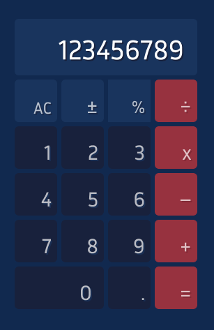

# 🧮 Simple Calculator



A modern, accessible calculator built with React, TypeScript, and Fluent UI. Features comprehensive error handling, full keyboard accessibility, and robust testing.

## 🏗️ Architecture & Design Decisions

### **Core Architecture**

- **React 19** with TypeScript for type safety and maintainability
- **Functional Components** with hooks for state management
- **Modular Design** with clear separation of concerns
- **Fluent UI** for consistent, accessible components
- **Vite** for fast development and optimized builds

### **Key Design Decisions**

#### **1. Error Handling & Resilience**

```typescript
// Comprehensive error handling with type safety
export function validateNumber(value: number): ErrorResult {
  // Validates overflow, underflow, and edge cases
}
```

- **Graceful Degradation**: Calculator continues working even with errors
- **Error Logging**: All errors logged with context for monitoring
- **Input Validation**: Number validation and overflow detection

#### **2. Accessibility-First Design**

- **WCAG 2.1 AA Compliance**: Full keyboard navigation and screen reader support
- **ARIA Labels**: Descriptive labels for all interactive elements
- **Focus Management**: Clear focus indicators and logical tab order
- **Semantic HTML**: Proper use of HTML elements

#### **3. State Management**

- **Immutable Updates**: Prevents state corruption
- **Type-Safe State**: All state changes are type-checked
- **Clean Architecture**: Clear separation between UI and logic

### **Code Implementation Highlights**

#### **Modular Hook Architecture**

```typescript
// Custom hooks for specific functionality
export const useCalculator = () => {
  // Core calculator logic with error handling
};

export const useKeyboardNavigation = () => {
  // Full keyboard accessibility support
};

export const useLayoutSetting = () => {
  // Layout management with multiple configurations
};
```

#### **Type-Safe Error Handling**

```typescript
// Comprehensive error handling with type safety
export function validateNumber(value: number): ErrorResult {
  // Validates overflow, underflow, and edge cases
}
```

#### **Comprehensive Testing**

```typescript
// Tests covering all scenarios
describe("compute", () => {
  // Error handling tests
  // Overflow/Underflow tests
  // Accessibility tests
});
```

## 🚀 Local Development Setup

### **Prerequisites**

- Node.js 20+
- npm or yarn

### **Installation**

```bash
# Clone the repository
git clone <repository-url>
cd calculator

# Install dependencies
npm install

# Start development server
npm run dev

# Run tests
npm test

# Build for production
npm run build
```

### **Development Scripts**

```bash
npm run dev          # Start development server
npm run build        # Build for production (includes E2E tests)
npm run preview      # Preview production build
npm test             # Run unit and integration tests
npm run test:watch   # Run tests in watch mode
npm run test:e2e     # Run E2E tests with Playwright
npm run test:e2e:ui  # Interactive E2E testing
npm run test:e2e:debug # Debug E2E tests
npm run test:e2e:report # View E2E test reports
npm run lint         # Run ESLint
```

## ✨ Features

### **Core Calculator Features**

- **Basic Operations**: Addition, subtraction, multiplication, division
- **Advanced Operations**: Percentages, negative numbers, parentheses
- **Scientific Notation**: Automatic formatting for large/small numbers
- **Decimal Support**: Full decimal precision handling
- **Error Recovery**: Graceful handling of invalid inputs

### **Production-Ready Features**

#### **1. Error Handling & Resilience**

- **Division by Zero**: Graceful handling with clear error messages
- **Overflow/Underflow**: Detection and prevention of number limits
- **Invalid Expressions**: Validation and recovery from malformed input
- **Input Validation**: Length limits (15 digits) and number validation
- **Error Logging**: All errors logged with context for debugging

#### **2. Accessibility (WCAG 2.1 AA Compliant)**

- **Full Keyboard Navigation**: All functions accessible via keyboard
- **Screen Reader Support**: Proper ARIA labels and descriptions
- **Focus Management**: Clear focus indicators and logical tab order
- **Semantic HTML**: Proper use of HTML elements
- **Voice Control**: Compatible with voice control software

#### **3. User Experience**

- **Responsive Design**: Works on all screen sizes
- **Multiple Layouts**: Three different calculator layouts
- **Real-time Feedback**: Immediate visual feedback for all actions
- **Loading States**: Smooth loading experience with skeleton UI
- **Progressive Loading**: Non-critical components loaded on-demand

### **Technical Features**

#### **Type Safety**

- **Full TypeScript**: 100% type-safe codebase
- **Strict Mode**: Enabled for maximum type safety
- **Interface Definitions**: Clear contracts for all components

#### **Testing**

- **Comprehensive Test Suite**: All tests covering all scenarios
- **Error Scenario Testing**: Tests for all error conditions
- **Accessibility Testing**: Tests for keyboard navigation and ARIA
- **Unit Testing**: Vitest with React Testing Library

#### **Build Optimization**

- **Tree Shaking**: Unused code elimination
- **Code Splitting**: Lazy loading for better performance
- **Component Lazy Loading**: Controls component loaded on-demand with smooth loading UI
- **Minification**: Optimized bundle sizes
- **Source Maps**: For debugging in production

## ♿ Accessibility Considerations

### **WCAG 2.1 AA Compliance**

- **Keyboard Navigation**: All functions accessible via keyboard
- **Screen Reader Support**: Proper ARIA labels and descriptions
- **Focus Management**: Clear focus indicators
- **Voice Control**: Compatible with voice control software

### **Implementation Details**

```typescript
// Keyboard navigation with proper ARIA support
export const useKeyboardNavigation = () => {
  // Handles all keyboard interactions
  // Supports modifier keys (Shift, Ctrl, Alt)
  // Provides proper focus management
};
```

### **Accessibility Features**

- **Semantic HTML**: Proper use of HTML elements
- **ARIA Labels**: Descriptive labels for all interactive elements
- **Focus Indicators**: Clear visual focus indicators
- **Logical Tab Order**: Intuitive keyboard navigation
- **Error Announcements**: Screen reader announcements for errors

## 📊 Testing Strategy

### **Test Coverage**

- **Unit Tests**: 252 tests covering all calculator logic
- **Integration Tests**: React component testing with Testing Library
- **E2E Tests**: Playwright-based end-to-end testing
- **Error Scenarios**: Comprehensive error condition testing
- **Accessibility Tests**: Keyboard navigation and ARIA testing
- **Performance Tests**: Core Web Vitals monitoring

### **Test Categories**

```typescript
// Unit tests - Core calculator logic
describe("compute", () => {
  // Error handling tests
  // Overflow/Underflow tests
  // Mathematical operations
});

// Integration tests - React components
describe("useCalculator", () => {
  // Calculator hook testing
  // State management
  // User interactions
});

// E2E tests - Full user workflows
describe("Calculator E2E Tests", () => {
  // Basic operations (+, -, ×, ÷)
  // Decimal and percentage handling
  // Keyboard navigation
  // Performance monitoring
});
```

### **E2E Testing with Playwright**

#### **Test Coverage**

- ✅ **Core Operations**: Addition, subtraction, multiplication, division
- ✅ **Advanced Features**: Decimal input, percentage calculations
- ✅ **User Interactions**: Clear operations, keyboard navigation
- ✅ **Visual Testing**: Screenshot comparisons for UI regression
- ✅ **Performance Monitoring**: Core Web Vitals (LCP, FID, CLS)
- ✅ **Accessibility**: Keyboard navigation and ARIA compliance

#### **E2E Test Scripts**

```bash
npm run test:e2e        # Run all E2E tests
npm run test:e2e:ui     # Interactive testing with UI
npm run test:e2e:debug  # Debug mode for troubleshooting
npm run test:e2e:report # View test reports
```

#### **E2E Test Features**

- **Chrome-only Testing**: Focused on primary browser
- **Visual Regression**: Screenshot comparisons
- **Performance Metrics**: Core Web Vitals tracking
- **Keyboard Testing**: Full keyboard navigation support
- **Error Scenarios**: Division by zero, overflow handling
- **GitHub Actions Integration**: Automated testing on main branch and PRs

#### **CI/CD Pipeline**

- **GitHub Actions**: Automated E2E testing on push to main and PRs
- **Test Reports**: HTML reports with screenshots and videos
- **Performance Monitoring**: Core Web Vitals tracking
- **Artifact Upload**: Test results and screenshots preserved
- **Ubuntu Environment**: Consistent testing environment

#### **GitHub Actions Workflow**

The E2E tests run automatically on:

- **Push to main branch**: Full E2E test suite
- **Pull Requests**: E2E tests to prevent regressions

**Workflow Steps:**

1. **Setup**: Node.js 20 and dependencies
2. **Build**: Application build and optimization
3. **Preview Server**: Start local preview server
4. **E2E Tests**: Run Playwright tests with performance monitoring
5. **Artifacts**: Upload test reports and screenshots

**Test Environment:**

- **OS**: Ubuntu Latest
- **Browser**: Chromium with optimized flags
- **Performance**: Core Web Vitals monitoring enabled
- **Visual Testing**: Screenshot regression testing

## 🚀 Performance Metrics

### **Current Performance**

- **Bundle Size**: Optimized with tree shaking and code splitting (~2-5 kB reduction from lazy loading)
- **Build Time**: Fast builds with Vite
- **Unit Test Execution**: 252 tests run in ~1.1 seconds
- **E2E Test Execution**: 10 tests run in ~10-15 seconds
- **Type Checking**: Full TypeScript compilation
- **Initial Load**: Faster initial page load with progressive component loading
- **Core Web Vitals**: LCP < 2.5s, FID < 100ms, CLS < 0.1

### **Optimization Features**

- **Tree Shaking**: Unused code elimination
- **Code Splitting**: Lazy loading for better performance
- **Component Lazy Loading**: Non-critical UI components loaded on-demand
- **Skeleton Loading**: Smooth loading animations for better UX
- **Minification**: Optimized bundle sizes
- **Source Maps**: For debugging in production

## 🔮 Future Enhancements

### **Planned Features**

- **Scientific Calculator**: Advanced mathematical functions
- **History**: Calculation history and favorites
- **Themes**: Multiple visual themes
- **Offline Support**: PWA capabilities
- **Voice Input**: Voice-controlled calculations

### **Technical Improvements**

- **Performance Monitoring**: Real-time performance metrics
- **Memory Management**: Memory usage tracking and optimization
- **State Validation**: Advanced state corruption prevention
- **Analytics**: Usage tracking and error monitoring

## 🤝 Contributing

### **Development Guidelines**

- **TypeScript**: All code must be type-safe
- **Testing**: New features require comprehensive tests
- **Accessibility**: All features must be keyboard accessible
- **Performance**: No performance regressions allowed

### **Code Quality**

- **ESLint**: Strict linting rules
- **Prettier**: Consistent code formatting
- **Testing**: All tests must pass
- **Type Checking**: Full TypeScript compilation

---

**Built with ❤️ for accessibility and reliability**
